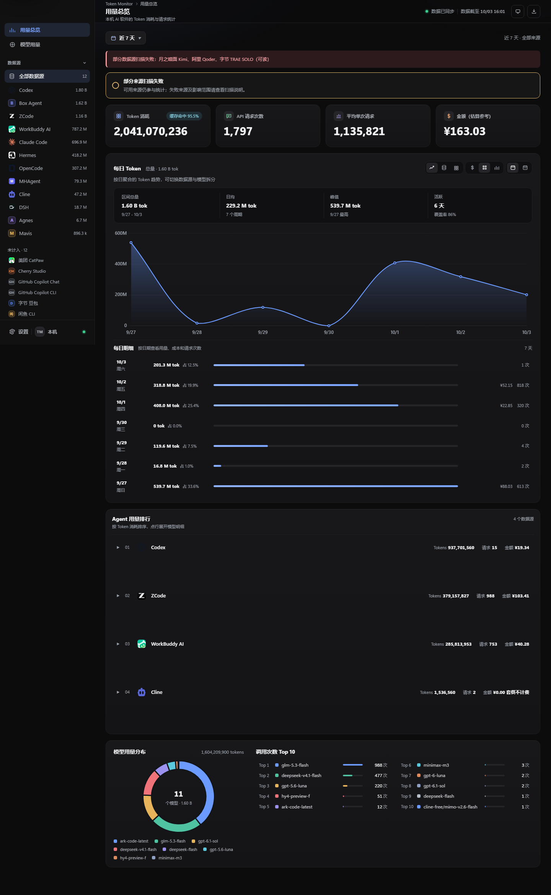
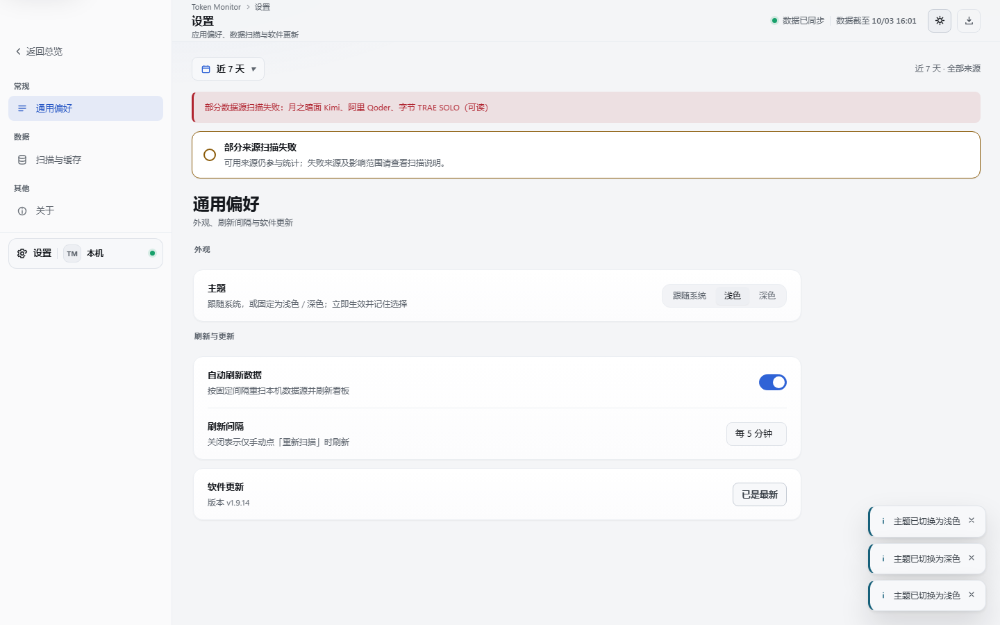
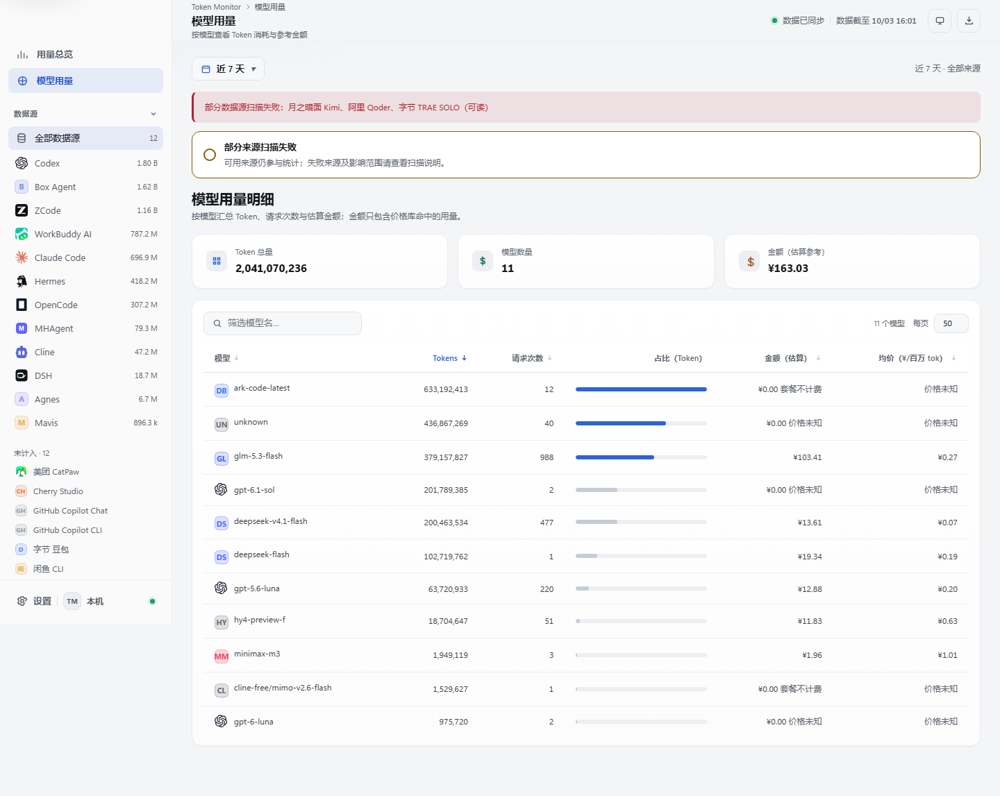
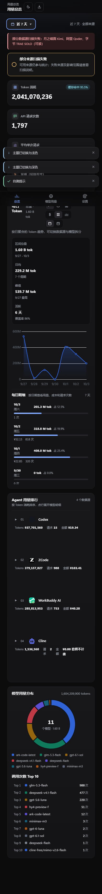
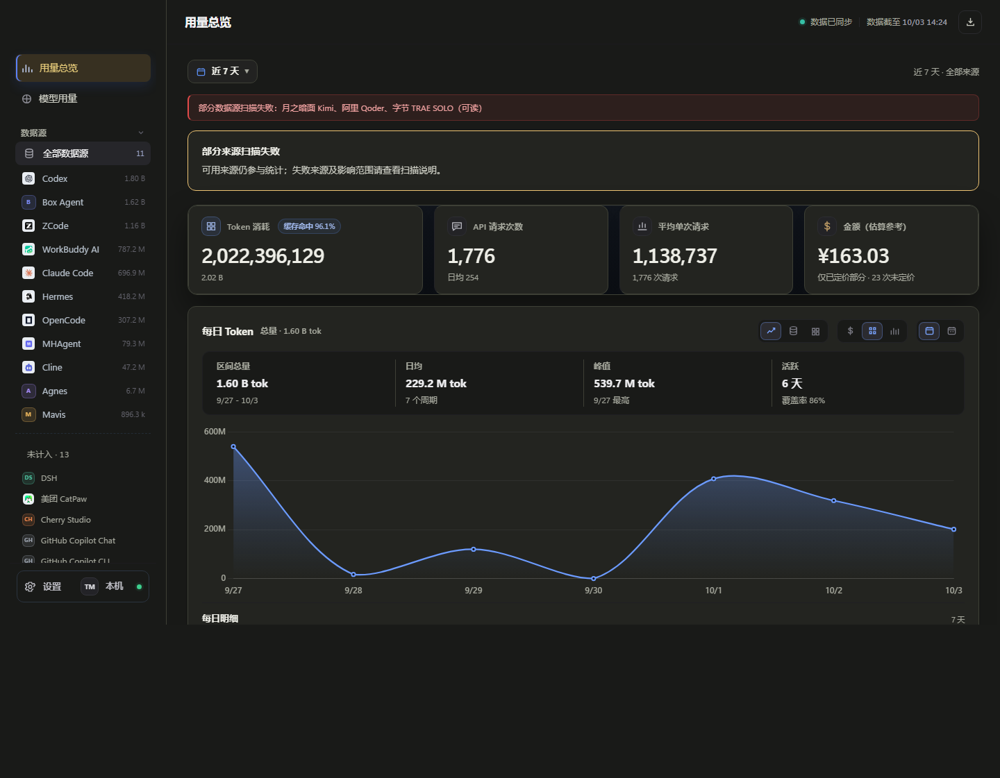

# Token Monitor · UI 设计规范

本文件是界面层的唯一规范来源。**所有数值都必须来自 `webapp/static/styles/tokens.css`**，
组件样式不得再写死颜色、字号、间距与圆角。

- 样式入口：`webapp/static/styles/styles.css`（index.html 只引用这一个样式表）
- 层叠层顺序：`legacy < base < components < layout`
- 校验脚本：`tools/ui_audit.py`（硬编码/字号/规范覆盖）、`tools/contrast_check.py`（对比度）、
  `tools/ui_verify.py`（DOM/焦点/对比度体检）、`tools/ui_smoke.py`（交互回归）、
  `tools/style_snapshot.py`（计算样式快照对比）

---

## 一、信息架构与导航

| 项目 | 约定 |
| --- | --- |
| 页面职责 | `用量总览`＝看趋势与构成；`模型用量`＝查明细表；`设置`＝改配置。一个视图只做一件事 |
| 主导航 | 侧栏一级导航（≥761px）；窄屏改为底部标签栏（≤760px），二者共用同一套 `switchView` |
| 二级导航 | 设置页分类（通用偏好 / 扫描与缓存 / 关于）显示在侧栏 `#setNav` |
| 面包屑 | 顶栏 `Token Monitor › 当前页面`，始终显示当前位置 |
| 深链接 | hash 路由：`#/overview`、`#/models`、`#/settings/{general,data,about}`；支持浏览器前进/后退 |
| 返回 | 设置页侧栏「← 返回总览」；`Esc` 关闭弹层；浏览器后退等价于返回上一视图 |
| 内容形态 | 时间序数据→图表；跨维度对比→表格；单个实体摘要→卡片；来源清单→列表 |

## 二、布局与栅格

| 项目 | 约定 |
| --- | --- |
| 栅格 | 12 列心智模型；KPI/汇总类用 `repeat(n, minmax(0,1fr))` 等分，列表用 `grid-template-columns` 显式列宽 |
| 间距阶梯 | `--sp-1..--sp-9` = 4 / 8 / 12 / 16 / 20 / 24 / 32 / 40 / 56 px |
| 页面骨架 | 侧栏固定 248px（平板 216px），内容列 `--content-max` 1240px（超宽屏 1360px）居中，内边距 `--content-pad-x/y` |
| 固定元素 | 侧栏 sticky 满高；顶栏 sticky 毛玻璃；表格 `thead` sticky；窄屏底部标签栏 fixed |
| 留白节奏 | 卡片内 20/16px；卡片间距 14px；区块间距 16px；标题到内容 12px |

断点：`≥1440`（内边距加大）、`≤1280`（侧栏 232/内容满宽）、`≤1024`（侧栏 216，KPI 两列）、
`≤760`（侧栏转底部标签栏，KPI 两列）、`≤480`（KPI 单列）、`≤360`（极限窄屏兜底）。

## 三、设计规范（设计系统）

全部 token 定义在 `tokens.css`，共 6 组：基础阶梯、深色主题、浅色主题、系统偏好、兼容别名、无障碍偏好。

- **色彩**：面 6 级（`--canvas/--surface/--surface-2/--surface-3/--side/--inset`）、
  线 3 级（`--line/--line-soft/--line-strong`）、文字 5 级（`--ink/--text/--text-2/--muted/--m-dim`）、
  语义 4 组（`--pos/--warn/--neg/--info`，各带 `-soft`）、指标 5 色（`--m-token/--m-cost/--m-req/--m-avg/--m-cache`）、
  图表 9 色（`--c1..--c9`）。同一语义全站只用同一个 token。
- **字体**：字号阶梯 9 档（11/12/13/14/16/20/24/30/32，另有 40 用于英雄数字）；
  字重仅 3 档（400/550/650）；行高 4 档；字体族 `--font-ui`（中文优先）/`--font-mono`。
- **形状**：控件 8px、面板 12px、卡片 14px、弹窗 16px、胶囊 999px、小标 4/6px。
- **阴影**：`--shadow-sm/md/lg` 三级 + `--shadow-focus` 焦点环；卡片材质用 `--card-bg` 渐变。
- **图标**：统一线性风格、`currentColor` 描边、16/20/24 网格、`stroke-width` 1.4–1.8。
- **token 化**：`components.css`/`layout.css`/`base.css` 中的硬编码颜色为 **0**。

## 四、基础组件规范

| 组件 | 类型/尺寸 | 必须覆盖的状态 |
| --- | --- | --- |
| 按钮 `.btn` | `btn-primary`（主）、`btn`（次）、`btn-ghost`（文字）、`btn-danger`（危险）；`btn-sm` 28 / 默认 34 / `btn-lg` 40 / `icon-btn` 方形 | 默认·悬停·按下·聚焦·禁用·加载（`aria-busy`） |
| 输入类 | `input[type=text/search]`、`select.set-sel`、`textarea`、`.field-search`（带图标搜索）、`.switch`（开关）、`.seg`（分段） | 默认·悬停·聚焦·错误（`aria-invalid`）·禁用 |
| 展示类 | `.table-card`（表格：sticky 表头、可排序 `th-sort`、数字右对齐、空态）、`.daily-row` + `.daily-track`、`.t10-row`、`.donut-wrap`、`.chip`、`.agent-mono` | 加载（骨架）·空·错误 |
| 导航类 | `#nav`、`#setNav`、`#tabbar`、`.crumb`、`.pager`（页码 + 上一页/下一页） | 默认·悬停·当前（`aria-current`） |
| 反馈类 | `.upd-modal`（弹窗）、`.confirm-card`（危险操作确认）、`.toast`（轻提示）、`.collection-state`（数据状态条） | 出现·关闭·焦点陷阱·Esc 取消 |

数据区三态：**加载**用 `.skeleton`（骨架屏，不用转圈）；**空**用 `.empty`（图标 + 说明 + 行动按钮）；
**错误**用 `.collection-state[data-kind=error]` + toast 提供重试入口。

## 五、状态设计

- 加载：首屏 KPI 骨架 → 数据到达后替换；按钮 `aria-busy="true"` 显示内联转圈；图表空态覆盖 `#mainEmpty`。
- 空：图表/每日明细/表格/来源列表各有专属空态文案，并给出「查看全部时间」等下一步动作。
- 错误：`collection-state` 明确写出原因与影响（"已有结果保留"），并提供「重新读取结果」。
- 成功：导出、重新扫描、设置保存、主题切换都有 toast 反馈（`kind=success`）。
- 断网/弱网：轮询失败时提示"暂时无法连接本地服务"，恢复后自动继续，手动重试入口常驻。

## 六、交互与动效

- 时长：`--dur-instant 90ms` / `--dur-fast 140ms` / `--dur-base 200ms` / `--dur-slow 280ms`。
- 缓动：`--ease-standard`（控件）、`--ease-out`（进场）、`--ease-in-out`（位移）。
- 微交互：悬停变色、按下位移 1px（`.is-pressing`）、聚焦显示焦点环。
- 过渡：视图切换淡入上移、菜单下拉、弹窗缩放淡入、骨架屏微光。
- 快捷键：`1`/`2` 切视图、`G` 设置、`/` 聚焦模型搜索、`R` 重新扫描、`Esc` 关弹层。
- 尊重系统：`prefers-reduced-motion: reduce` 时全部时长归零并关闭图表动画。

## 七、可访问性

- 键盘：所有交互元素可达（体检脚本逐个聚焦验证焦点环）；`skip-link` 直达主内容；分段控件方向键切换；下拉 `↑/↓/Home/End/Esc`。
- 焦点：`base.css` 统一定义 `:focus-visible` 焦点环（2px + 2px offset），焦点陷阱用于弹窗，关闭后焦点归还。
- 对比度：`tools/contrast_check.py` 校验全部「文字 token × 表面 token」组合，深浅两套主题均 **0 处不达标**（AA 正文标准）。
- 语义：`main`/`aside`/`nav`/`header` landmark、`aria-current`、`aria-pressed`、`aria-expanded`、`aria-sort`、`aria-live` 播报、`role="img"` + `aria-label` 描述图表。
- 不只靠颜色：错误/警告同时用图标、文字与边框；状态点带文字标签。
- 可缩放：字号使用 px 阶梯但布局全为弹性/网格，系统缩放 125%/150% 与浏览器缩放下不破版。

## 八、多端与多主题

- 主题三态：`跟随系统`（默认，不写 `data-theme`）、`浅色`、`深色`；顶栏按钮循环切换，设置页也可选；选择记入 `localStorage("tm-theme")`。
- 首帧不闪：`index.html` 内联脚本在样式表之前落地主题。
- 图表随主题：`charts.js` 用 `getComputedStyle` 读取 `--c1..--c9`，切主题后重绘即换色。
- 平台差异：Windows 下滚动条自绘 10px；`aside-top` 保留 52px 原生标题栏拖拽区。
- 高 DPI：图标用 SVG；位图徽标以 `object-fit: contain` 定尺寸，避免 125%/150% 模糊。

## 九、内容与文案

- 按钮文案：动词 + 对象（"重新扫描""导出 CSV""检查更新""更新并重启"）。
- 错误文案：说清"发生了什么 + 影响 + 怎么办"，例如
  「统计结果读取失败：读取失败（HTTP 500）；上次有效结果仍可查看。」
- 数字格式化统一走 `TMUI.fmt`：整数千分位、Token 用 B/M/k、金额 `¥` 两位小数、
  百分比一位小数、日期 `zh-CN` 区域、时间 `HH:mm`。
- 长文本：模型名/来源名 `text-overflow: ellipsis` + `title` 完整显示；
  错误描述 `overflow-wrap: anywhere` 防溢出。
- 本地化：界面为中文，`lang="zh-CN"`；数字/日期均通过 `Intl`，便于后续扩展语言。

## 十、性能体验

- 首屏：KPI 先出骨架；`/api/summary` 单请求拿全量聚合。
- 大数据量：模型表分页（25/50/100/全部，默认 50）+ 本地搜索（180ms 防抖）+ 表头排序；
  Agent 排行分批渲染（每批 12 条，"继续显示剩余"），迷你图用 `IntersectionObserver` 进入视口才创建。
- 资源：品牌图 `loading="lazy" decoding="async"`；单个 vendor 依赖（Chart.js）本地内置。
- 响应：切视图后 `requestAnimationFrame` 内重算画布尺寸，避免隐藏态测量导致的空白图。

## 十一、边界与异常

- 超长模型名：省略号 + `title`；超多数据：分页 + 分批渲染。
- 极端窗口：360px 起可用；超宽屏内容居中不拉伸。
- 重复提交：导出按钮在导出期间禁用；扫描按钮 `disabled` + `aria-busy`；轮询请求去重（`metaRequest`/`summaryRequest`）。
- 超时/失败：`fetch` 失败一律给出可见提示 + 重试入口；不静默吞错。

## 十二、安全与隐私（UI 层）

- 全部统计在本机完成，界面「关于」页明确写出：不上传任何用量数据，服务仅监听 127.0.0.1。
- 危险/不可逆操作二次确认：`TMUI.confirm()` 提供 `role="alertdialog"` + 焦点陷阱 + Esc 取消。
- 权限/不可用状态：无数据时按钮禁用并说明原因（如"尚不能导出"），不给出可点却无效的入口。
- 注入防护：所有插入 DOM 的文本经 `esc()` 转义（release notes 先转义再套结构）。

## 十三、可维护性

- 组件复用：按钮/输入/卡片/状态条/toast/弹窗只有一处实现（`components.css` + `TMUI`）。
- token 集中：改一处全局生效；`tokens.css` 是唯一数值来源。
- 层叠可控：四层结构 + `@layer` 顺序明确；`!important` 仅 3 处（设置页侧栏显示切换），且均有注释说明。
- 历史样式：11 个旧样式表归档在 `styles/legacy-src/`，可用
  `python tools/consolidate_legacy_css.py` 重新生成 `legacy.css` 并取消 `styles.css` 中的注释回滚。
- 规范文档：本文件；组件属性见上文表格与 `components.css` 注释。

---

## 附：多端与主题实拍

| 视图 | 截图 |
| --- | --- |
| 总览 · 深色（1440×900，整页） |  |
| 设置 · 浅色 |  |
| 模型用量 · 深色（表格 + 分页 + 排序） |  |
| 窄屏 390px（底部标签栏接管导航） |  |
| 改版前（对比用） |  |

## 附：视觉标识（保留的"计量台"语言）

- 近黑画布 + 顶部两团极光（蓝主、橙辅），浅色主题为极淡同色氛围。
- 卡片用"浅一层的面"+ 极细描边 + 内高光，而不是重描边堆叠。
- 语义色固定：Token=蓝、金额=暖橙、请求=薄荷绿、均值=紫、缓存=青。
- 数字一律 `font-variant-numeric: tabular-nums`，KPI 用大字号 + 紧字距。
